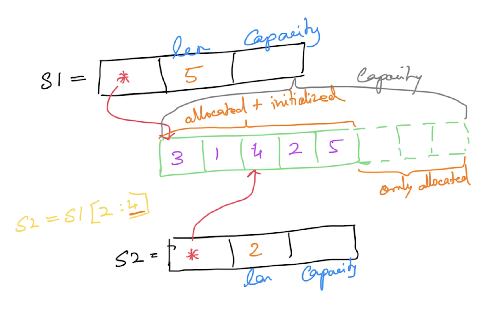

# Go Foundation

## Magesh Kuppan
- tkmagesh77@gmail.com

## Software Requirement
- Go Tools (https://go.dev/dl)
    - verification
        ```shell
        go version
        ```
- Visual Studio Code (https://code.visualstudio.com)

## Repository
- https://github.com/tkmagesh/cisco-go-jun-2024

## Schedule
- Commence      : 9:00 AM
- Tea Break     : 10:30 AM (15 mins)
- Lunch Break   : 12:30 PM (1 hr)
- Tea Break     : 3:00 PM (15 mins)
- Wind up       : 5:00 PM

## Methodology
- No powerpoints
- Code & Discuss
- Floor is open for Q&A at all times during the class

## Why Go?
- Concurrency
    - Managed Concurrency using "Goroutines"
    - Very cheap (~4KB)
    - Very efficient
    - Support is built in  the "language" itself
        - go "keyword", channel "data type", channel "operator" ( <- ), range & select-case "constructs"
    - API support through standard library
        - "sync" package
        - "sync/atomic" package
- Lightweight
    - Compiled to machine code
    - Execution Speed (equivalent to c++)
- Simplicity
    - ONLY 25 keywords
    - No access modifiers (public/private/protected)
    - No reference types (everything is a value)
    - No class (only structs)
    - No inheritance (only composition)
    - No exceptions (only errors)
    - No "try-catch-finally"
    - No implicit type conversion
    - No pointer arithmatic

## Standard Library
    - https://pkg.go.dev/std

## "go" Tool
Create a build
```shell
go build [file_name_1.go] [file_name_2.go] ...
go build -o [binary_name] [file_name_1.go] [file_name_2.go] ...
```
Build and execute
```shell
go run [file_name.go]
```
## Data Types
- string
- bool
- integers
    - int8
    - int16
    - int32
    - int64
    - int
- unsigned integers
    - uint8
    - uint16
    - uint32
    - uint64
    - uint
- floating points
    - float32
    - float64
- complex
    - complex64 ( real[float32] + imaginary[float32] )
    - complex128 ( real[float64] + imaginary[float64] )
- alias
    - byte (alias for unnsigned int)
    - rune (alias for unicode code point)

### Zero values
| Data Type | Zero value |
------------ | ------------- |
|int family     | 0 |
|uint family    | 0 |
|complex family | (0+0i) |
|string         | "" (empty string) |
|bool           | false |
|byte           | 0 |
|interface      | nil |
|pointer        | nil |
|function       | nil |
|struct         | struct instance |

## Variables
### Declaration
- Using the "var" keyword
    - memory allocated
    - memory initialized with the "zero" value of the data type (by default)
    - can be used in package & function scope
- Using ":="
    - memory allocated
    - memory initialized with the given value
    - cannot use in the package scope

## Scope
### Function Scope
- Cannot have unused variables
- Can use ":="
### Package Scope
- Can have unused variables
- Cannot use ":="

## Functions
- No support for function overloading
- Functions can return more than 1 result
    - Use "named" results for more than 1 result
- Anonymous Functions
    - Anonymous functions cannot have any name
    - Anonymous functions have to invoked immediately
- Higher Order Functions (ability to treats functions like data)
    - Functions can be assigned as values to variables
    - Functions can be passed as arguments to other functions
    - Functions can be returned as return values from other functions

## Escape analysis
```
go run -gcflags="-m" [filename.go]
go build -gcflags="-m" [filename.go]
```
 
## Disable function inlining
```
go run -gcflags="-l" [filename.go]
go build -gcflags="-l" [filename.go]
```

## Collections
### Array
- Fixed sized typed collection
- Memory is allocated & initialized automatically
- Arrays are "values"

### Slice
- Dynamic sized typed collection
- Uses an array internally
- len() => size of the slice
- cap() => capacity of the underlying array
- append() => add new values to the slice
- copy() => copies the data into a new slice


### Map
- Typed collection of key/value pairs
- delete() => delete a key
